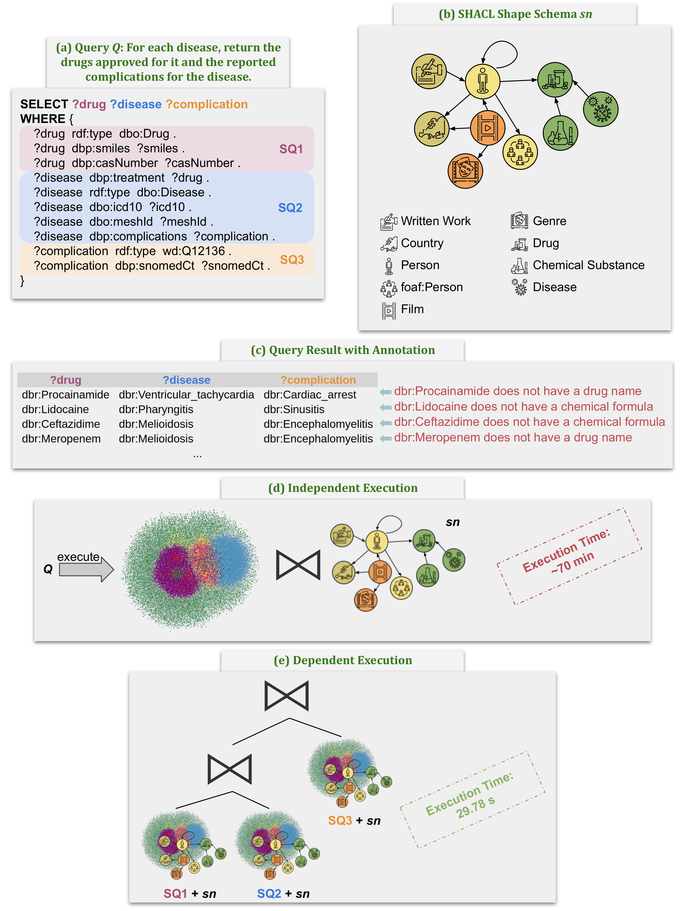
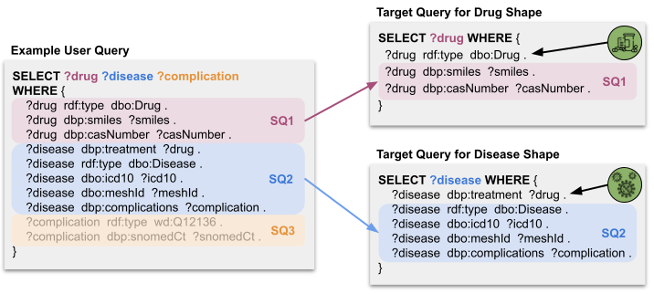
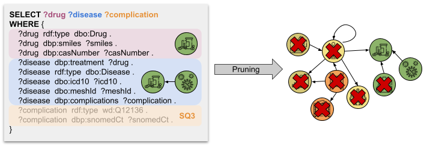
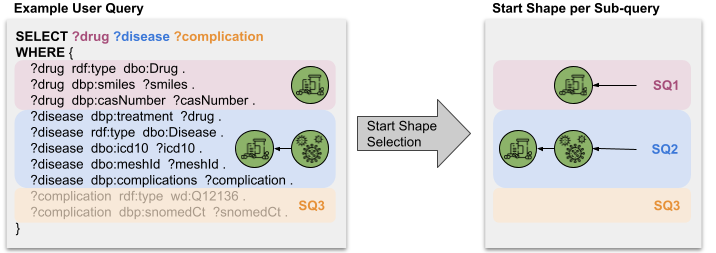
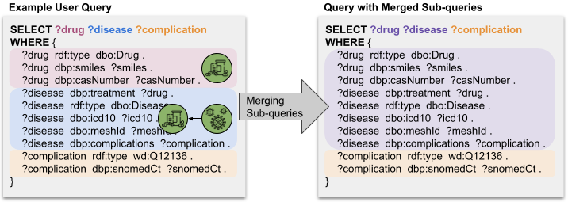

# TracedSPARQL: An Overview

## Motivation

Figure 1: Motivating Example over DBpedia.

Figure 1 present the motivating example of TracedSPARQL.
Figure 1a shows a SPARQL query Q about drugs, diseases, and complications.
Figure 1b depicts a SHACL shape schema sn consisting of nine shapes imposing integrity constraints on the respective RDF classes in DBpedia, the RDF graph G.
The query result for the SPARQL query Q with manual annotation based on the validation of sn is presented in Figure 1c.
Figure 1d reports the independent execution of the query Q and the shape schema sn is a costly approach.
Figure 1e represents a dependent execution, i.e., the SHACL validation is invoked on a subset of the shapes from sn for each sub-query (SQ1-SQ3). Evaluating only relevant shapes improves the performance considerably.

## Heuristics

In the following, the proposed heuristics are briefly mentioned and illustrated with an example.

Figure 2: Heurisitc 1 - Target Query Reformulation.

The triple pattern(s) from the query Q are added to the target definition of the shape s in order to increase the selectivity of the target definition.
Hence, less instances need to be validated.

Figure 3: Heurisitc 2 - Shape Schema Reduction.

The shape schema is reduced to a sub-schema that only includes the shapes that are reachable from the shape s that is associated to the query Q.

Figure 4: Heurisitc 3 - Start Shape Selection.

As start shape for the SHACL validation, the shape s associated with the query Q is chosen.

Figure 5: Heurisitc 4 - Merging Sub-queries.

If two sub-queries that can be joined have an overlap in the SHACL shape schema that needs to be validated for each respective sub-query, the two sub-queries are merged into one sub-query in order to avoid the re-validation of shared shapes.

