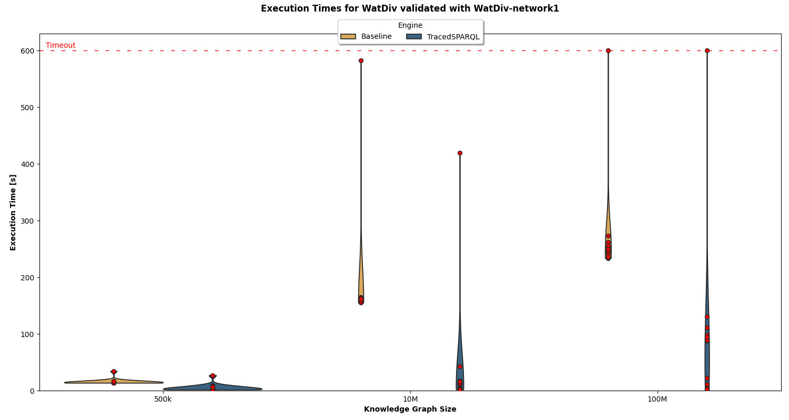

# TracedSPARQL: Results

## LUBM

Figure 1: Execution time in LUBM KGs validated with LUBM-schema1.

Figure 2: Execution time in LUBM KGs validated with LUBM-schema2.

Figures 1 and 2 show the execution time for the validation of the LUBM KGs with the shape schemas _LUBM-schema1_ and _LUBM-schema2_ respectively.
The baseline is not able to produce results in the large KG (LKG).
The execution times are higher in LUBM-schema2 due to its higher complexity.

## WatDiv

Figure 3: Execution time in WatDiv KGs validated with WatDiv-schema1.

Figure 4: Execution time in WatDiv KGs validated with WatDiv-schema2.

Figures 3 and 4 show the execution time for the validation of the WatDiv KGs with the shape schemas _WatDiv-schema1_ and _WatDiv-schema2_ respectively.
TracedSPARQL outperforms the other approaches in both shape schemas.
Only the engines using Trav-SHACL are able to perform the queries.
The execution times are slightly lower in WatDiv-schema2 due to its lower complexity.

## DBpedia

Figure 5: Execution time in DBpedia.

Figure 5 shows the execution time for the validation of DBpedia.
Only the engines relying on Trav-SHACL are able to perform the queries.
TracedSPARQL outperforms the baseline in all queries.
The baseline is not able to perform most of the queries, especially the ones with multiple sub-queries.

## Ablation Study

Figure 6: Ablation study over the medium-sized KG (MKG) from LUBM validated with LUBM-schema2.

Figure 7: Ablation study over the 10M triple KG from WatDiv validated with WatDiv-schema1.

Figure 8: Ablation study over DBpedia.

The results of the ablation study are reported in Figures 6,7, and 8.
The heurisitics correspond to the Heurisitic 1-4 from the paper.
Heuristic 1 is the target query reformulation, Heuristic 2 is the shape schema reduction, Heuristic 3 is the start shape selection, and Heurisitic 4 is merging sub-queries.
As can be seen, pruning the shape schema (Heurisitc 2) has the highest individual impact.
Combining all heuristics results in the lowest execution times.

## Overhead

Figure 9: Comparison of Execution Time with and without Validation.

Figure 9 reports the results of the overhead analysis, i.e., the difference in executing a SPARQL query Q and the corresponding TracedSPARQL query Q' w.r.t. to a SHACL shape schema.
It can be seen that performing the SHACL validation during query processing adds a considerable overhead.

